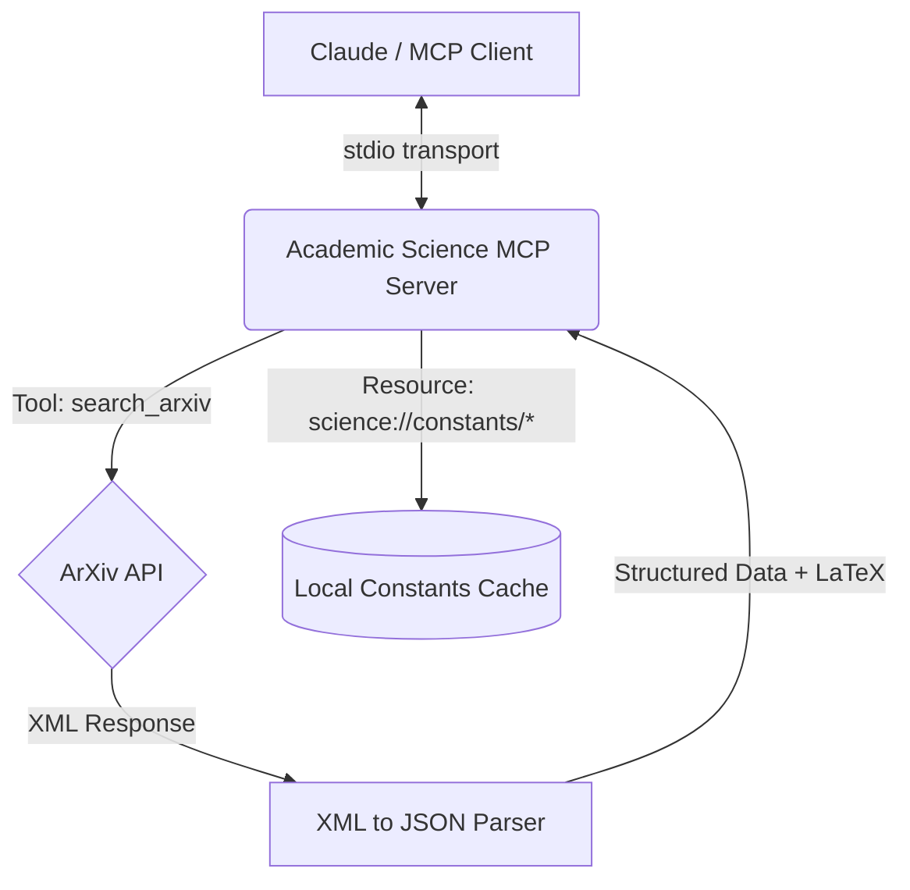

# Academic Science MCP

A specialized Model Context Protocol (MCP) server for Claude that retrieves and formats complex scientific data, LaTeX formulas, and academic paper summaries.

## Why This Exists

Generic search tools often struggle with the nuances of academic research. They may strip out crucial LaTeX formatting, lose the structure of scientific papers, or fail to provide quick access to fundamental constants. 

**Academic Science MCP** bridges this gap for science students, researchers, and academics by:
1. **Preserving Math**: Ensuring LaTeX equations (like $E=mc^2$ or $\\hat{H} |\\Psi\\rangle = E |\\Psi\\rangle$) are correctly formatted for Claude to render.
2. **Structured Data**: Returning academic papers as structured JSON (Title, Authors, Abstract, URL) rather than a wall of text.
3. **Local Caching**: Providing instant access to fundamental Physics and Chemistry constants via MCP Resources.

## System Architecture



## Quick Start

### Installation

```bash
npm install
npm run build
```

### Configuration (Claude Desktop)

Add the following to your `claude_desktop_config.json`:

```json
{
  "mcpServers": {
    "academic-science": {
      "command": "node",
      "args": ["/absolute/path/to/academic-science-mcp/dist/index.js"]
    }
  }
}
```

### Available Features

- **Tools**: 
  - `search_arxiv`: Searches the ArXiv database for academic papers.
- **Resources**: 
  - `science://constants/physics`: Fundamental physics constants.
  - `science://constants/chemistry`: Fundamental chemistry constants.

## Development

```bash
# Run tests
npm test

# Run linter
npm run lint

# Format code
npm run format
```
