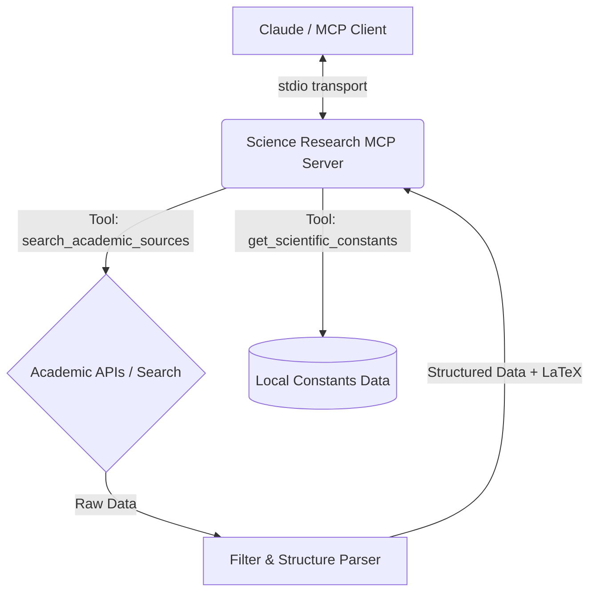

# Science Research MCP

A High-Impact Academic & Science Research MCP Server designed to solve the noise problem in AI-driven scientific research. 

**Target Audience:** STEM Students, JEE Aspirants, and Academic Researchers.

## Solving the Noise Problem

When AI assistants perform generic web searches for scientific topics, the results are often polluted with pop-science articles, SEO spam, and oversimplified explanations. 

**Science Research MCP** acts as a foundational piece of educational infrastructure by:
1. **Enforcing Academic Rigor**: Automatically appending strict academic filters (`site:arxiv.org OR site:edu OR site:researchgate.net`) to all search queries.
2. **Structured Data Delivery**: Returning academic papers as structured JSON (Title, Authors, Abstract, URL) rather than unstructured text walls.
3. **Instant Constants**: Providing a dedicated tool for retrieving fundamental Physics and Chemistry constants (Planck's, Gas constant, etc.) instantly.

## Mathematical Formatting

Generic search tools often strip out crucial LaTeX formatting, making complex equations unreadable. This MCP server explicitly preserves and formats mathematical expressions using standard LaTeX delimiters so Claude can render them perfectly.

**Example Output:**
```json
{
  "symbol": "G",
  "latex": "$G$",
  "value": 6.6743e-11,
  "unit": "m^3/(kg\\cdot s^2)"
}
```
*Claude renders this as: $G = 6.6743 \times 10^{-11} \text{ m}^3/(\text{kg}\cdot\text{s}^2)$*

## System Architecture



## Quick Start

### Installation

```bash
npm install
npm run build
```

### Configuration (Claude Desktop)

Add the following to your `claude_desktop_config.json`:

```json
{
  "mcpServers": {
    "science-research": {
      "command": "node",
      "args": ["/absolute/path/to/science-research-mcp/dist/index.js"]
    }
  }
}
```

### Available Features

- **Tools**: 
  - `search_academic_sources`: Searches academic sources for scientific papers with automatic filtering.
  - `get_scientific_constants`: Returns a structured JSON of Physics and Chemistry constants in LaTeX format.

## Roadmap

- [ ] **WolframAlpha API Integration**: Planned integration to allow Claude to compute complex integrals and differential equations.
- [ ] **Crossref DOI Resolution**: Add a tool to fetch full citation metadata from a DOI.
- [ ] **PubMed Integration**: Expand search capabilities to include medical and biological research databases.

## Development

```bash
# Run tests
npm test

# Run linter
npm run lint

# Format code
npm run format
```
